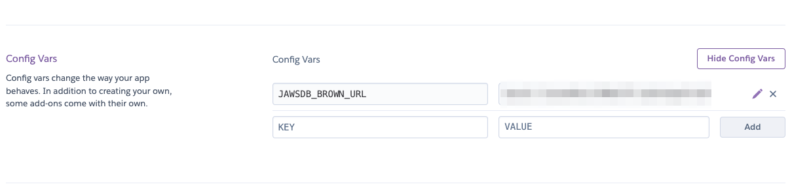
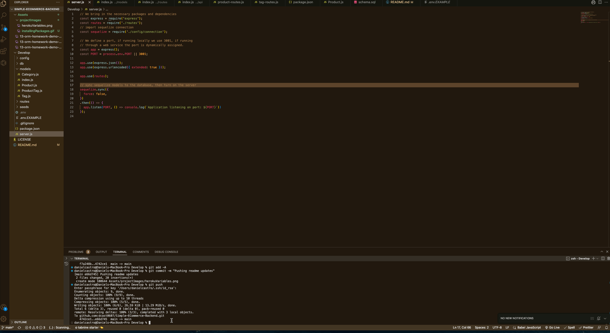
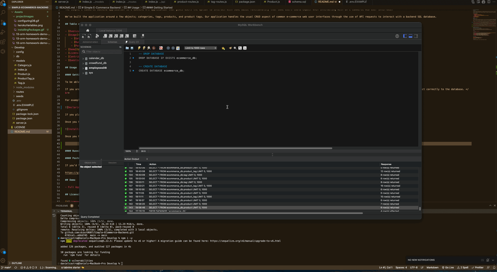
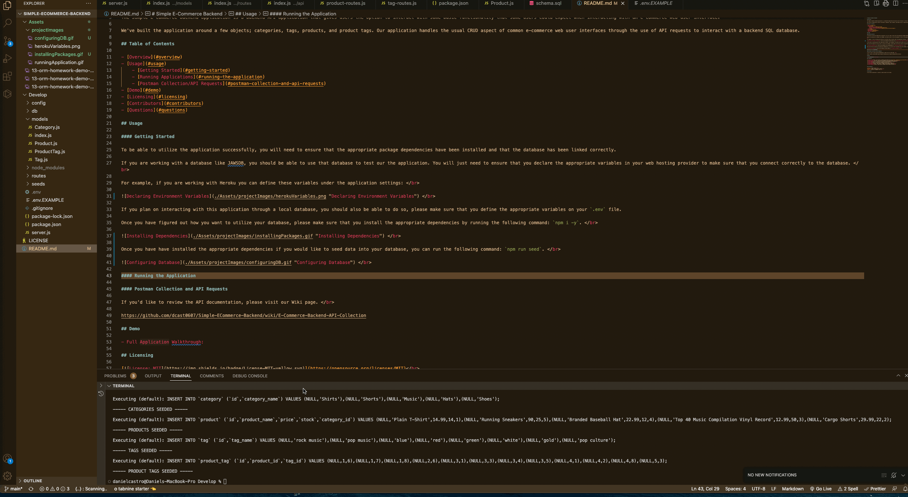

# Simple E-Commerce Backend

## Overview

The Simple E-Commerce Backend application is a backend API application that gives users the option to interact with some basic functionality that some users could expect when interacting with an e-commerce web user interface. 

We've built the application around a few objects; categories, tags, products, and product tags. Our application handles the usual CRUD aspect of common e-commerce web user interfaces through the use of API requests to interact with a backend SQL database. 

## Table of Contents

- [Overview](#overview)
- [Usage](#usage)
    - [Getting Started](#getting-started)
    - [Running Applications](#running-the-application)
    - [Postman Collection/API Requests](#postman-collection-and-api-requests)
- [Demo](#demo)
- [Licensing](#licensing)
- [Contributors](#contributors)
- [Questions](#questions)

## Usage

#### Getting Started

To be able to utilize the application successfully, you will need to ensure that the appropriate package dependencies have been installed and that the database has been linked correctly. 

If you are working with a database like JAWSDB, you should be able to use that database to test our the application. You will just need to ensure that you declare the appropriate variables in your web hosting provider to make sure that you connect correctly to the database.  

For example, if you are working with Heroku you can define these variables under the application settings:  

  

If you plan on interacting with this application through a local database, you should also be able to do so, please make sure that you define the appropriate variables on your `.env` file. 

Once you have figured out how you want to utilize your database, please make sure that you install the appropriate dependencies by running the following command: `npm i -y`.  

  

Once you have have installed the appropriate dependencies if you would like to seed data into your database, you can run the following command: `npm run seed`.  

  

#### Running the Application

To start using the API you will need to run the following command: `npm start`. This will let you make requests to the API. Please refer to the API documentation selection below for more information on how to user the API. 

  

#### Postman Collection and API Requests

If you'd like to review the API documentation, please visit our Wiki page.  

https://github.com/dcast0607/Simple-ECommerce-Backend/wiki/E-Commerce-Backend-API-Collection

## Demo

- Full Application Walkthrough: https://www.loom.com/share/4fd2f99aaaed41ac8d656298e611131c

## Licensing

 
 
 
 
 
 
 

## Contributors

**Author:** Daniel Castro  
**Github:** https://github.com/dcast0607  
**Email:** dancastro.java@gmail.com  

## Questions

If you have any questions or concerns, please contact me via email. 